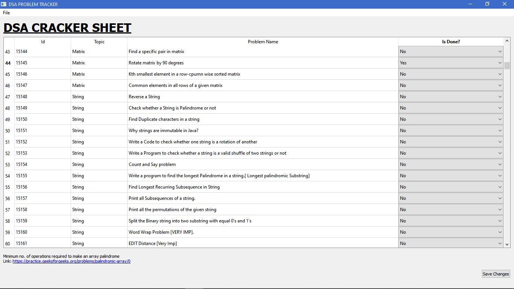
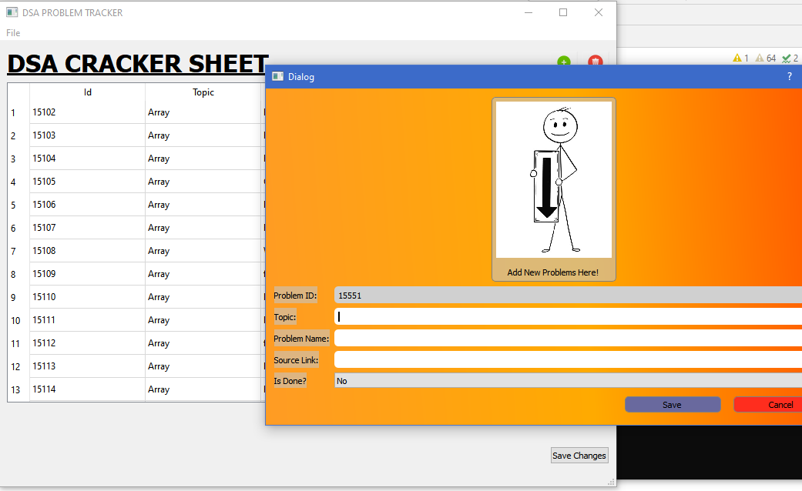

# Track-Learning-Progress
Software to Monitor the progress of your study by practicing some interesting coding problems.

### START EXPLORING WITH 
    ```
    python app_main.py  
    ```

## Python Version and Modules Required
`'3.7.4 (tags/v3.7.4:e09359112e, Jul  8 2019, 19:29:22) [MSC v.1916 32 bit (Intel)]'`
Install the required modules from requirements.txt file by running: ``pip install -r requirements.txt``

## Why I created this?

I have created this Desktop software for College students like me to practice coding effectively.
Also, the basic materials used in this softwares, i.e. The set of Problems come from the DSA cracker sheet provided by 
<a href="https://www.youtube.com/lovebabbar-1">Love Babbar</a>.
I am so much thankful to him, as he took this great initiative to organize such huge volume of important codes and providing this to everyone!

## What's special about it?

You can load the json file provided along with the package to this software and mark some problems as complete or not complete.
And save your progress, you can view number of problems you solved and click links to open problems directly in your browser.
_You basically don't have to open the excel sheet each time and edit and save them or copy-paste problem links to open them!_

## Current Features:

- **Load DSA sheet** from any place you save (this is basically a JSON file generated from the excel sheet) in your computer.

- You can either **Save-as** or **save** files.

- **Update Problems**, mark them as done or not done and save them.

- **Filter View:** View only solved problems or only unsolved problems

*_Note_: I haven't spend much time on creating this, just one evening, may be 2-3 hours, but I think doing this will help many children.

# News:

- **NEW Update [02-12-2020]**: Now, You'll be able to add new problems through this application along with their links and monitor them too.

# PREVIEW
<p align="center">

</p>
    <hr>
<h2>Added New window to enter new problems</h2>
<html>
<p align="center">

    </p>
